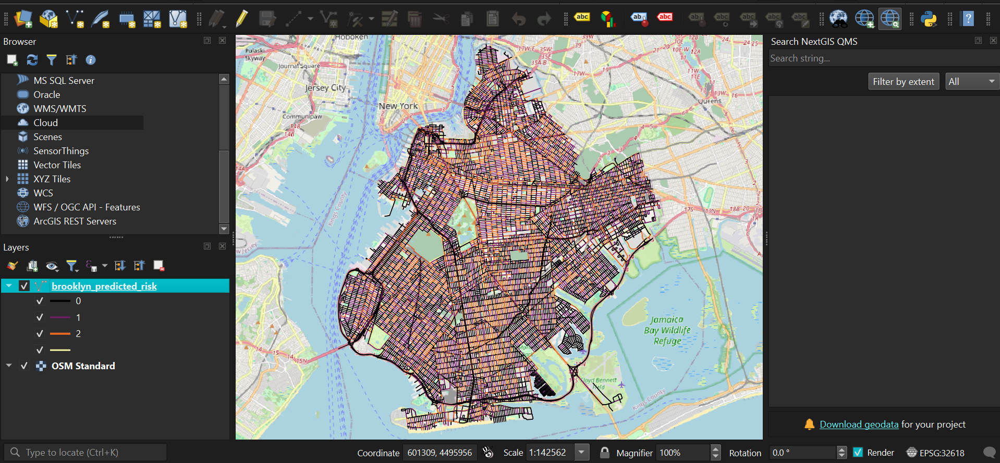

# Traffic Mapping

A Python pipeline for predicting traffic risk on Brooklyn road segments using NYPD accident data and OpenStreetMap road networks.

## Tech Stack

- **Language:** Python
- **Machine Learning:** scikit-learn (Random Forest), XGBoost
- **Geospatial Analysis:** GeoPandas, OSMnx, Shapely
- **Data Processing:** Pandas, NumPy
- **Data Source:** NYPD Motor Vehicle Collisions Dataset
- **Visualization:** QGIS

## Overview

This project ingests NYPD motor vehicle collision data, snaps accidents to the nearest road segments, and trains a Random Forest classifier to predict risk tiers across Brooklyn's road network. The output is a GeoJSON file that can be visualized in any GIS tool (QGIS, ArcGIS, etc.).

## Risk Tiers

| Tier | Label | Criteria |
|------|-------|----------|
| 0 | Low | 0 accidents on the road segment |
| 1 | Medium | 1–5 accidents on the road segment |
| 2 | High | 6+ accidents on the road segment |

## Pipeline

1. **Load & Clean** — Reads `database.csv`, filters to Brooklyn, and engineers time-based and severity features.
2. **Road Network** — Downloads Brooklyn's drive network from OpenStreetMap via OSMnx and projects to UTM zone 18N.
3. **Spatial Join** — Snaps each accident to the nearest road segment (within 30 m).
4. **Aggregation** — Counts accidents per road segment and assigns risk tiers; cleans OSM attributes (`maxspeed`, `lanes`).
5. **Classification** — Trains a Random Forest on road length, speed limit, and lane count to predict risk tier.

## Setup

```bash
pip install pandas geopandas osmnx scikit-learn shapely
python pipeline.py
```

## Libraries Used

| Library | Purpose |
|---------|---------|
| **pandas** | Data loading, cleaning, and manipulation |
| **geopandas** | Spatial data handling and GeoDataFrame operations |
| **osmnx** | Downloading and projecting OpenStreetMap road networks |
| **scikit-learn** | Random Forest classifier for risk prediction |
| **shapely** | Creating geometry objects (Point) for spatial joins |
| **numpy** | Numeric operations and missing value handling |

## Visualization

QGIS was used to visualize the output GeoJSON, with road segments color-coded by predicted risk tier overlaid on the OSM Standard basemap.

### Version 1 — Baseline


### Version 2 — Enhanced


### Version 3 — XGBoost



## Results

### Version 1 — Baseline

The initial Random Forest classifier achieved a model accuracy of **51.74%** on the test set.

### Version 2 — Enhanced (71.68%)

The improved model achieved a model accuracy of **71.68%**.

Detailed classification metrics:

| Class | Precision | Recall | F1-Score | Support |
|-------|-----------|--------|----------|---------|
| Low Risk (0) | 0.73 | 0.92 | 0.81 | 3135 |
| Medium Risk (1) | 0.60 | 0.39 | 0.47 | 1835 |
| High Risk (2) | 0.83 | 0.68 | 0.75 | 1097 |
| **Accuracy** | | | **0.72** | **6067** |
| Macro Avg | 0.72 | 0.66 | 0.68 | 6067 |
| Weighted Avg | 0.71 | 0.72 | 0.70 | 6067 |

### Version 3 — XGBoost Optimized (87.49%)

Random Forest achieved a validation accuracy of **87.57%**, while the optimized XGBoost model achieved **87.49%**.

#### Why XGBoost Won

- **Handling Non-Linear Interdependencies:** Random Forest builds trees completely independently of one another. XGBoost uses Gradient Boosting, meaning it builds trees sequentially. Each new tree specifically targets the calculation errors made by the previous trees.
- **Optimization Efficiency:** By incorporating a learning rate (η = 0.1) and structural regularization parameters, XGBoost managed to find subtle patterns across Brooklyn's dense, high-volume avenues without succumbing to overfitting or stalling on messy outliers.

Detailed XGBoost classification metrics:

| Class | Precision | Recall | F1-Score | Support |
|-------|-----------|--------|----------|---------|
| Low Risk (0) | 0.86 | 1.00 | 0.93 | 3135 |
| Medium Risk (1) | 0.88 | 0.68 | 0.77 | 1835 |
| High Risk (2) | 0.90 | 0.85 | 0.88 | 1097 |
| **Accuracy** | | | **0.87** | **6067** |
| Macro Avg | 0.88 | 0.84 | 0.86 | 6067 |
| Weighted Avg | 0.88 | 0.87 | 0.87 | 6067 |

## Output

- `brooklyn_predicted_risk.geojson` — Road segments with predicted risk, accident counts, and road attributes.
