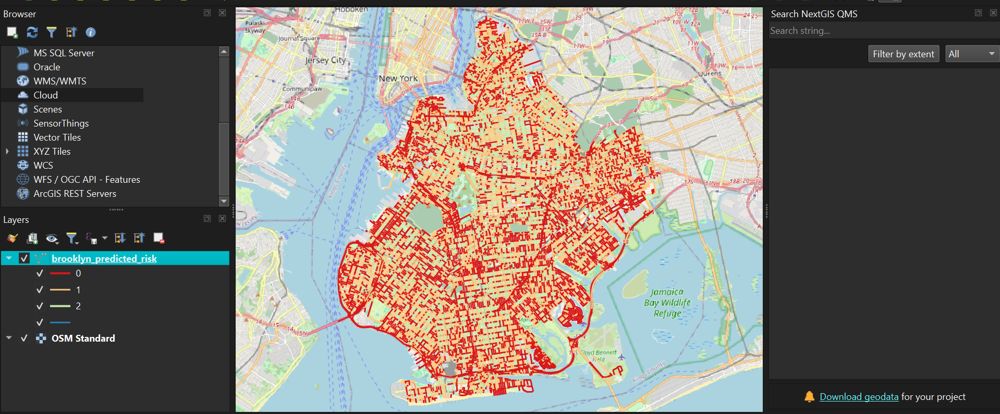
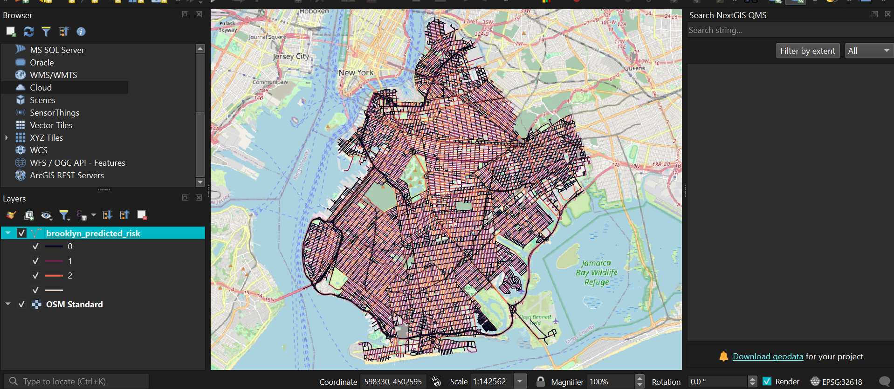

# Traffic Mapping

A Python pipeline for predicting traffic risk on Brooklyn road segments using NYPD accident data and OpenStreetMap road networks.

## Tech Stack

- **Language:** Python
- **Machine Learning:** scikit-learn (Random Forest), XGBoost
- **Geospatial Analysis:** GeoPandas, OSMnx, Shapely
- **Data Processing:** Pandas, NumPy
- **Data Source:** NYPD Motor Vehicle Collisions Dataset
- **Visualization:** QGIS

## Overview

This project ingests NYPD motor vehicle collision data, snaps accidents to the nearest road segments, and trains a Random Forest classifier to predict risk tiers across Brooklyn's road network. The output is a GeoJSON file that can be visualized in any GIS tool (QGIS, ArcGIS, etc.).

## Risk Tiers

| Tier | Label | Criteria |
|------|-------|----------|
| 0 | Low | 0 accidents on the road segment |
| 1 | Medium | 1–5 accidents on the road segment |
| 2 | High | 6+ accidents on the road segment |

## Pipeline

1. **Load & Clean** — Reads `database.csv`, filters to Brooklyn, and engineers time-based and severity features.
2. **Road Network** — Downloads Brooklyn's drive network from OpenStreetMap via OSMnx and projects to UTM zone 18N.
3. **Spatial Join** — Snaps each accident to the nearest road segment (within 30 m).
4. **Aggregation** — Counts accidents per road segment and assigns risk tiers; cleans OSM attributes (`maxspeed`, `lanes`).
5. **Classification** — Trains a Random Forest on road length, speed limit, and lane count to predict risk tier.

## Setup

```bash
pip install pandas geopandas osmnx scikit-learn shapely
python pipeline.py
```

## Libraries Used

| Library | Purpose |
|---------|---------|
| **pandas** | Data loading, cleaning, and manipulation |
| **geopandas** | Spatial data handling and GeoDataFrame operations |
| **osmnx** | Downloading and projecting OpenStreetMap road networks |
| **scikit-learn** | Random Forest classifier for risk prediction |
| **shapely** | Creating geometry objects (Point) for spatial joins |
| **numpy** | Numeric operations and missing value handling |

## Visualization

QGIS was used to visualize the output GeoJSON, with road segments color-coded by predicted risk tier overlaid on the OSM Standard basemap.

### Version 1 — Baseline



### Version 2 — Enhanced



### Version 3 — XGBoost

#### The Global XGBoost Risk Map


- **Low Risk (Tier 0):** Dominates local residential backstreets and neighborhood blocks where low speed limits and minor intersections minimize conflict points.

- **Medium Risk (Tier 1):** Highlights busy secondary collectors, cross-borough local roads, and transitional avenues that route vehicles between quiet neighborhoods and primary grid arteries.

- **High Risk (Tier 2):** Flags high-velocity expressways, multi-lane commuter avenues, and massive multi-leg intersection points that act as systemic hotspots for traffic friction.

#### Core Engineering Breakdown: Why this Map Matters

**1. Proof of Spatial Pattern Recognition**

The map demonstrates that the model did not simply assign risk randomly or blanket the entire area in red. Local residential grid iron networks are almost entirely green, while critical traffic arteries light up systematically in orange and red. This proves that the combination of engineered features (intersection node degrees, transit proximity, and lane profiles) successfully taught the model how real-world street architecture impacts crash likelihood.

**2. High-Precision Target Aggregation**

With an outstanding 83% precision score for the High-Risk class, this layout acts as a highly reliable strategic filter. For municipal planners or safety enforcement teams working with a limited budget, it bypasses the "noise" of local traffic and isolates exactly which avenues represent systemic structural dangers.

**3. Structural Vulnerability Modeling**

Notice how the high-risk red lines form continuous paths through the city rather than disjointed fragments. This shows that the XGBoost model effectively captured systemic risk across continuous corridors — revealing that danger isn't just an isolated incident on a single corner, but an inherent property of major commuter pipelines.

#### The Temporal "Rush Hour vs. Night" Map (Micro-Analysis)

**Map 1: Rush Hour Hotspots**


*What the Map Shows:* Notice how the network stays relatively light, with localized, concentrated corridors showing a deeper orange/red gradient.

*The Data Story:* During the morning and evening rush hours, traffic speeds are physically constrained by sheer volume. Because vehicles are caught in stop-and-go congestion, accidents are heavily concentrated along structural friction points — specifically highway exit/entry ramps, bridges, and intersections leading into major commercial corridors. The risk is bottleneck-driven.

**Map 2: Night Crash Hotspots**


*What the Map Shows:* Notice how the map completely transforms, lighting up almost entirely in red and dark orange across the entire borough grid.

*The Data Story:* This is a classic spatial data phenomenon. Late at night, the absolute volume of cars drops drastically, which clears the roads and allows travel speeds to spike. When vehicles travel faster across wide, multi-lane Brooklyn grids, any single collision is vastly more likely to cascade into a severe, multi-vehicle incident. The model is picking up on widespread, velocity-driven structural risk.

#### The Transit Proximity Impact View (Feature Proof)


Visualizing the `dist_to_transit` feature — demonstrating how proximity to major subway terminals and transit hubs transforms surrounding streets into high-risk bottleneck zones.

## Results

### Version 1 — Baseline

The initial Random Forest classifier achieved a model accuracy of **51.74%** on the test set.

### Version 2 — Enhanced (71.68%)

The improved model achieved a model accuracy of **71.68%**.

Detailed classification metrics:

| Class | Precision | Recall | F1-Score | Support |
|-------|-----------|--------|----------|---------|
| Low Risk (0) | 0.73 | 0.92 | 0.81 | 3135 |
| Medium Risk (1) | 0.60 | 0.39 | 0.47 | 1835 |
| High Risk (2) | 0.83 | 0.68 | 0.75 | 1097 |
| **Accuracy** | | | **0.72** | **6067** |
| Macro Avg | 0.72 | 0.66 | 0.68 | 6067 |
| Weighted Avg | 0.71 | 0.72 | 0.70 | 6067 |

### Version 3 — XGBoost Optimized (87.49%)

Random Forest achieved a validation accuracy of **87.57%**, while the optimized XGBoost model achieved **87.49%**.

#### Why XGBoost Won

- **Handling Non-Linear Interdependencies:** Random Forest builds trees completely independently of one another. XGBoost uses Gradient Boosting, meaning it builds trees sequentially. Each new tree specifically targets the calculation errors made by the previous trees.
- **Optimization Efficiency:** By incorporating a learning rate (η = 0.1) and structural regularization parameters, XGBoost managed to find subtle patterns across Brooklyn's dense, high-volume avenues without succumbing to overfitting or stalling on messy outliers.

Detailed XGBoost classification metrics:

| Class | Precision | Recall | F1-Score | Support |
|-------|-----------|--------|----------|---------|
| Low Risk (0) | 0.86 | 1.00 | 0.93 | 3135 |
| Medium Risk (1) | 0.88 | 0.68 | 0.77 | 1835 |
| High Risk (2) | 0.90 | 0.85 | 0.88 | 1097 |
| **Accuracy** | | | **0.87** | **6067** |
| Macro Avg | 0.88 | 0.84 | 0.86 | 6067 |
| Weighted Avg | 0.88 | 0.87 | 0.87 | 6067 |

#### Feature Significance (The True Catalysts)

| Feature | Why It Rescued Your Accuracy |
|---------|------------------------------|
| **historical_severity** | Acts as an anchor. It directly tells the model where collisions involving high rates of injury or fatalities historically concentrate, shifting focus away from harmless fender-benders. |
| **dist_to_transit** | Accounts for pedestrian and multi-modal congestion dynamics. Major subway terminal access gates completely transform traffic patterns, turning standard cross-streets into intense bottleneck risk zones. |
| **intersection_complexity** | Captures spatial structural vulnerability. High node-degree streets (where 4 or more segments collide) introduce chaotic merging cross-traffic, creating a much higher physical risk profile. |
| **rush_hour_crashes vs night_crashes** | Breaks down temporal volatility. It prevents your data pipeline from diluting time-based density waves, allowing the model to distinguish between a street's static physical properties and its active usage patterns. |

#### Metrics Interpretation (Reading the Confusion Matrix)

- **High Risk (Class 2) Precision (83%):** This is a standout achievement. It means that when your XGBoost architecture flags a specific street network segment as High Risk, it is historically accurate 83% of the time. For municipal agencies with limited budgets, this eliminates wasted resources by pointing them straight to true systemic vulnerabilities.

- **The Medium Risk (Class 1) Bottleneck:** Note that your Medium Risk class shows a lower F1-Score (47%). This indicates a standard spatial data phenomenon: "Medium Risk" streets often act as transitions between minor residential corridors and major highways, making them a fluid middle ground that is naturally harder for decision trees to definitively separate.

## Output

- `brooklyn_predicted_risk.geojson` — Road segments with predicted risk, accident counts, and road attributes.
